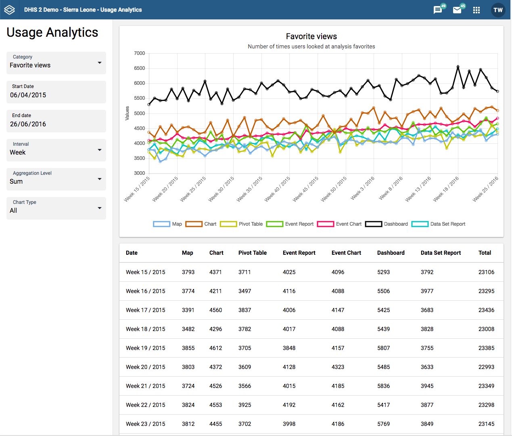

# Visualize usage statistics { #using_usage_analytics }

## About the Usage Analytics app

The **Usage Analytics** app lets you visualize statistics on how users
are working with the **Dashboard**, **Pivot Table**, **GIS**, **Event
Visualizer**, **Data Visualizer** and **Event Reports** apps within
DHIS2. With this statistics you can answers questions such as:

-   How many times people have loaded charts, pivots tables and
    dashboards?

-   How many favorites have users created?

-   How many users that are logging in versus total number of users?

-   What are the most viewed favorites?

## Create a usage analytics graph { #usage_analytics_create_chart }

1.  Open the **Usage Analytics** app.

2.  Select a **Start date** and **End date**.

3.  Select an **Interval**: day, week month or year.

4.  Select a **Category**.

    There are five analytics categories:

    -   **Favorite views**: Provides the number of times various types
        of favorites have been viewed, such as charts, pivot tables and
        dashboards, over time. This analysis lets you switch between all
        types of favorites, the total across all types and the average
        number of views.

    -   **Favorites**: Provides the number of favorites which have been
        created and stored in the system over time.

    -   **Users**: Provides the number of active as well as total number
        of users over time.

    -   **Top favorites**: Shows the most viewed favorites in the system
        by type.

    -   **Data values**: Provides the number of data values stored in
        the system over time.

5.  Click **Update**.
